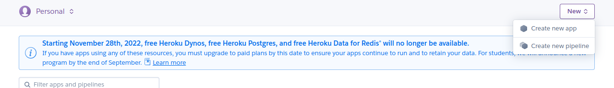
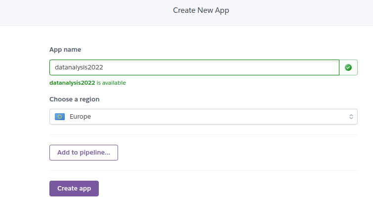
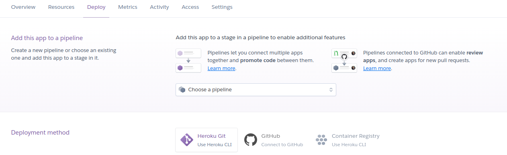
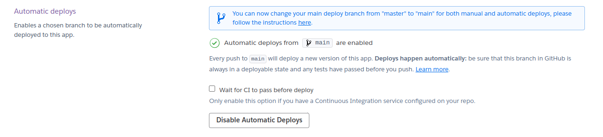
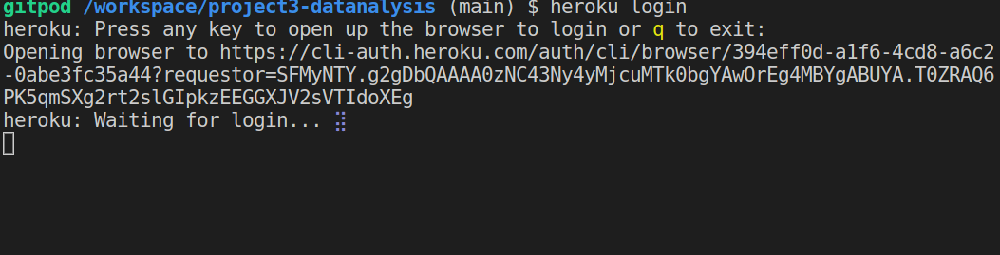
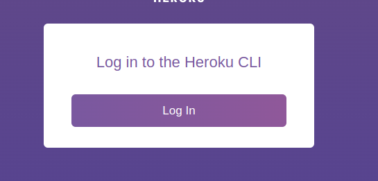

<h1 align="center">Analyzing Kaggle Data Science Survey of 2021</h1>

[View the live project here.](https://dataanalysis2021.herokuapp.com/)

Kaggle is a professional community for data scientists and machine learning engineers. They conduct developer surveys every year, and the collected data is available open-source on the web. With proper analysis, the Dataset would help us to answer real-world questions. For instance, we can find the most popular language that the data scientists use. Our project is to analyze the survey data and gather meaningful insights from it.

The questions that we answered as part of the analysis were given in the Data analysis. This readme.md file explains our project.

<h2 align="center"></h2>

## User Experience (UX)

-   ### Design
    -   Since the application is a commandline application, it has a simple User interface consisting of black background and white text.

    - The font of the interface is monospace.

        
## Features

- Runs in a commandline.
- Prompts a user for input wen needed


## Technologies Used

### Languages Used

-   [Python](https://www.python.org/)
This is a general purpose programming language that was used to build the commandline application.


### Frameworks, Libraries & Programs Used

1. [Pandas](https://pandas.pydata.org/)
    - This is a Python library for data analysis and manipulation. It is what was used to read the CSV survey data and covert it into dataframes which could be easy to analyze.
2. [Numpy](https://numpy.org/)
    - This is a tool for scientific computing using Python. This helps us group our data into arrays, we also used it to access functions that were necessary for making decisions of attributes in our dataframes.
3. [Time](https://fonts.google.com/)
    - This module provides various time-related functions.
4. [Git](https://git-scm.com/)
    - Git was used for version control by utilizing the Gitpod terminal to commit to Git and Push to GitHub.
5. [GitHub:](https://github.com/)
    - GitHub is used to store the projects code after being pushed from Git.
6. [Heroku:](https://heroku.com)
    - This is the platform that gave us the environment for easy deployment.


## Deployment

The project was deploying on Heroku. The steps for the deployment are demonstrarted in three ways.


The project was deployed to Heroku using the following steps...

### 1. Locally
All project development was done using [Gitpod](https://gitpod.io)
After development, changes would be commited to the local Git repository. All the project components were kept as provided in the template.

Project requirements were kept in a ```requirements.txt ``` file that is neccessary to help install them during the deployment phase.

The sample data is also added to Git as ```survey.csv```

Changes would be commited to the remote repository. on Github.

### GitHub
All the changes were backed up on a remote git [repository](https://github.com/alig2039/project3-datanalysis) on GitHub. This is necessary as deployment will be done from Heroku using the repository.


### Heroku
The final deployment is done from Heroku. Here is a summary with illustrations of how this was done.

The first step was to create a Heroku application as shown below.
<h2 align="center"></h2>

 Giving the app a name
<h2 align="center"></h2>

After Creating the app, the next thing to do was connect to the github repository and enable automatic deploys.
<h2 align="center"></h2>

Successful connection to GitHub
<h2 align="center"></h2>

Automatic Deploys from the main branch
<h2 align="center"></h2>

Then in Gitpod, added were the required [buildpacks](https://devcenter.heroku.com/articles/buildpacks) for the app to run. These were [heroku/nodejs](https://devcenter.heroku.com/articles/nodejs-support) and the [heroku/python](https://devcenter.heroku.com/articles/python-support). All these were done using the Heroku CLI.

<h2 align="center"></h2>
A login to the CLI via the web browser

<h2 align="center"></h2>
Setting the the builpack for NodeJS was done wit the command ``` heroku buildpacks:set heroku/nodejs ```

Adding the Python buildpack 


## Credits

### Code

-   [Gitpod](https://gitpod.io): The development of this project was made easy. They provided a really efficient workspace for developed this Python based application.

-   [Kaggle](https://kaggle.com): Most of te data analysis knowledge that was used to develop this application was inspired by the work of the brilliant data scientists on the platform.

-   [Python](https://python.org/) : The programming language that made building thhe application easier. With a wide variety of in-built standard library tools, the applicationn development was made easy

### Content

-   All content was written by the developer.

-   Psychological properties of colours text in the README.md was found [here](http://www.colour-affects.co.uk/psychological-properties-of-colours)

### Media

-   All Images were created by the developer.

### Acknowledgements

-   My Mentor for continuous helpful feedback.

-   Tutor support at Code Institute for their support.