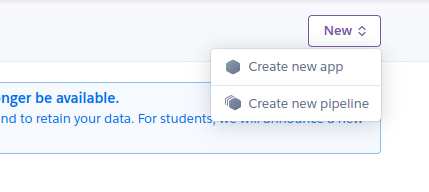
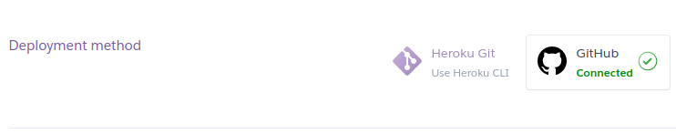
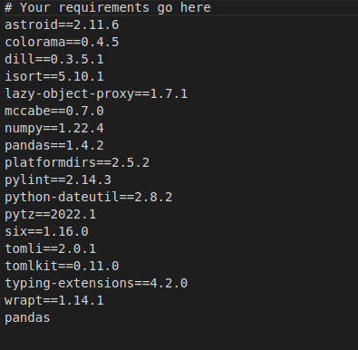

<h1 align="center">Analyzing Kaggle Data Science Survey of 2021</h1>

[View the live project here.](https://dataanalysis2021.herokuapp.com/)

Kaggle is a professional community for data scientists and machine learning engineers. They conduct developer surveys every year, and the collected data is available open-source on the web. With proper analysis, the Dataset would help us to answer real-world questions. For instance, we can find the most popular language that the data scientists use. Our project is to analyze the survey data and gather meaningful insights from it.

The questions that we answered as part of the analysis were given in the Data analysis. This readme.md file explains our project.

<h2 align="center"></h2>

## User Experience (UX)

-   ### Design
    -   #### Colour Scheme
        -   The two main colours used are black, and white.
    -   #### Typography
        -   The Montserrat font is the main font used throughout the whole website with Sans Serif as the fallback font in case for any reason the font isn't being imported into the site correctly. Montserrat is a clean font used frequently in programming, so it is both attractive and appropriate.

        
## Features

-   Runs in a commandline


## Technologies Used

### Languages Used

-   [Python](https://en.wikipedia.org/wiki/HTML5)


### Frameworks, Libraries & Programs Used

1. [Pandas](https://pandas.pydata.org/)
    - .This is a Python library for data analysis and manipulation. It is what was used to read the CSV survey data and covert it into dataframes which could be easy to analyze.
2. [NUmpy](https://numpy.org/)
    - This is a tool for scientific coputing using Python. This helps us group our data into arrays, we also used it to access functions that were necessary for making decisions of attributes in our dataframes.
3. [Time](https://fonts.google.com/)
    - This module provides various time-related functions.
4. [Git](https://git-scm.com/)
    - Git was used for version control by utilizing the Gitpod terminal to commit to Git and Push to GitHub.
5. [GitHub:](https://github.com/)
    - GitHub is used to store the projects code after being pushed from Git.
6. [Heroku:](https://www.adobe.com/ie/products/photoshop.html)
    - This is the platform that gave us the environment for easy deployment.


### Known Bugs

- Since it is a CLI application, it can only run within a terminal environment.

## Deployment

### Heroku

The project was deployed to Heroku using the following steps...

1. Create a [Heroku account](https://signup.heroku.com/login).
2. Create a Heroku app.
<h3 align="center"></h3>
3. Go to the Deploy tab and connect the app to Github. This will be helpful for automatic deploys.
<h2 align="center"></h2>
4. Then You can select the Github repository to connect to the Heroku app.
<h2 align="center"></h2>


### Locally
1. Add a requirements.txt to you project using ```pip3 install -r requirements.txt```
<h2 align="center"></h2>


## Credits

### Code

-   The full-screen hero image code came from this [StackOverflow post](https://stackoverflow.com)

-   [Bootstrap4](https://getbootstrap.com/docs/4.4/getting-started/introduction/): Bootstrap Library used throughout the project mainly to make site responsive using the Bootstrap Grid System.

-   [MDN Web Docs](https://developer.mozilla.org/) : For Pattern Validation code. Code was modified to better fit my needs and to match an Irish phone number layout to ensure correct validation. Tutorial Found [Here](https://developer.mozilla.org/en-US/docs/Web/HTML/Element/input/tel#Pattern_validation)

### Content

-   All content was written by the developer.

-   Psychological properties of colours text in the README.md was found [here](http://www.colour-affects.co.uk/psychological-properties-of-colours)

### Media

-   All Images were created by the developer.

### Acknowledgements

-   My Mentor for continuous helpful feedback.

-   Tutor support at Code Institute for their support.